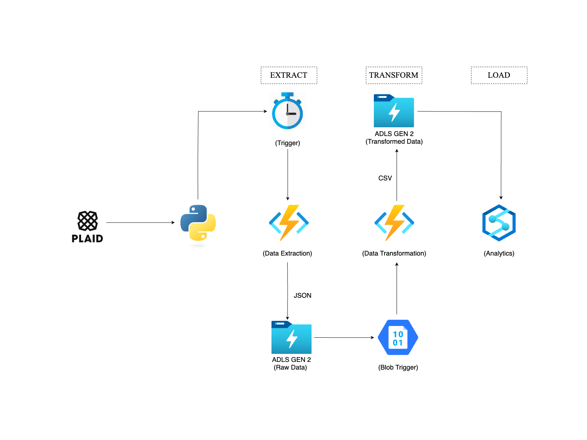

# Plaid Azure ETL Pipeline

## Project Overview

This is a Python-based end-to-end ETL (Extract, Transform, Load) pipeline built using Microsoft Azure cloud services. It integrates Plaid's financial transaction data with Azure to automate the extraction, transformation, and storage of account and transaction data from Plaid's sandbox environment.

The pipeline processes the data using Azure Functions and Python, stores raw and transformed outputs in **Azure Data Lake Storage Gen2 (ADLS Gen2)**, and enables downstream querying and analytics via Azure Synapse Analytics. It is designed to be fully serverless, automated, and cloud-native.

---

## 🧭 Overall Architecture

This diagram illustrates the full end-to-end flow of the pipeline from Plaid to Azure Synapse Analytics.

---

## Tech Stack

- **Azure Functions (Python)**: Serverless compute for orchestrating extraction and transformation workflows.
- **Plaid API (Python SDK)**: Financial data provider API to retrieve transaction and account information.
- **Azure Data Lake Storage Gen2 (ADLS Gen2)**: Cloud-based data lake built on top of Blob Storage, used to store raw JSON data and transformed CSV files.
- **Pandas**: Data processing and transformation library used to clean, normalize, and structure financial data.
- **Azure Synapse Analytics**: Data warehouse and analytics service to run complex queries and analytics on transformed datasets.
- **Python 3.12**: Programming language used for all development.
- **Environment Variables**: Secure configuration via environment variables for Plaid credentials and Azure connection strings.

---

## End-to-End Data Flow

### 1. Scheduled Extraction

- An Azure Function triggers monthly (on the 1st day at midnight) to extract transactions from Plaid’s Sandbox API.
- It dynamically computes the previous month’s date range.
- The function obtains a sandbox public token, exchanges it for an access token, and requests transaction data for the specified date range.
- Raw JSON data is saved into **ADLS Gen2** under `raw-data/to_process/` with a timestamped filename.

### 2. Transformation and Loading

- A second Azure Function is triggered automatically when new blobs appear in `raw-data/to_process/`.
- It reads all new JSON files, extracts relevant transaction and account data, and performs data cleansing and normalization using Pandas.
- Transformed data is saved as CSV files into ADLS Gen2 containers `transactions_data/` and `accounts_data/` within the `transformed-data` container.
- Processed raw JSON files are moved from `to_process/` to `processed/` folder to avoid re-processing.

### 3. Querying with Azure Synapse Analytics

- The `transformed-data` ADLS Gen2 container is linked as an **external data source** within Azure Synapse Analytics.
- Using `OPENROWSET` SQL commands, Synapse directly queries the CSV files without explicit ingestion or data movement.

---

## Environment Configuration

The following environment variables must be set for the Azure Functions in `local.settings.json` file:

- `PLAID_CLIENT_ID` — Plaid API client ID.
- `PLAID_SECRET` — Plaid API secret.
- `AZURE_CONN_STR` — Azure Storage connection string for ADLS Gen2.
- `EXTRACT_CONTAINER_NAME` — Container name for raw data (default: `raw-data`).
- `OUTPUT_CONTAINER_NAME` — Container name for transformed data (default: `transformed-data`).

---

## Key Features and Benefits

- Fully serverless architecture with Azure Functions, reducing infrastructure management.
- Automated scheduling and event-driven processing.
- Modular code design allowing easy extension for additional products or integrations.
- Secure handling of credentials via environment variables.
- Efficient data transformation using Pandas ensuring clean and analytics-ready datasets.
- Seamless querying through Azure Synapse Analytics without needing to load data into SQL pools.

  
## References

- **Plaid API (Python SDK)**: Financial data provider API to retrieve transaction and account information.
  [Official Docs](https://plaid.com/docs/api)

